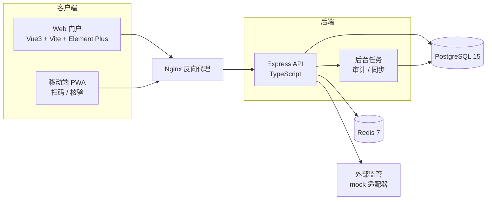

# 高校化学品全生命周期监管平台 — 技术架构文档

## 1. 总体架构

## 2. 模块划分

- **采购计划**：月度申购、库存建议、三级审批、采购任务。
- **暂存台账**：试剂主数据、追溯码（QR + RFID 兼容）、入库单、附件。
- **领用审批**：申请单、三级审批流、高危品类复核。
- **双人核验**：核验会话、双签到、定位、录像存证、锁具指令。
- **使用登记**：用量流水、剩余量告警、续购提醒。
- **废液归集**：相容性矩阵、废液桶、跨学院交接。
- **空瓶回收**：空瓶主数据、清洗/销毁/厂家回收。
- **统计报表**：基于 `audit_events` 物化视图。
- **审计追溯**：追溯码主键聚合查询。
- **合规对接**：mock 适配器，预留真实对接位。

## 3. 数据模型（核心表）

- `organizations`：院系 / 实验室 / 仓库
- `users`：用户与角色
- `chemicals`：化学品种类（CAS、危化等级、储存要求）
- `reagent_bottles`：试剂瓶（唯一追溯码、批次、剩余量、状态）
- `procurement_plans`：采购计划主表
- `procurement_items`：采购计划明细
- `requisitions`：领用申请
- `dual_verifications`：双人核验记录
- `usage_logs`：使用登记
- `waste_buckets`：废液桶
- `waste_handoffs`：废液交接
- `empty_bottles`：空瓶回收
- `audit_events`：不可变审计流水
- `compliance_reports`：合规对接上报记录

## 4. 关键技术决策

- **追溯码生成**：UUIDv4 + CRC16，二维码内容形如 `CHEM:xxxxxxxx:CRC`，RFID TID 与之绑定。
- **审计流水**：所有写操作同步追加 `audit_events`，触发器保证不可删改。
- **离线同步**：前端使用 IndexedDB 暂存操作队列，恢复网络后批量重放。
- **高并发**：连接池 + Redis 缓存（字典、热点追溯码）。
- **安全**：JWT 鉴权 + 角色守卫 + 操作日志。

## 5. 接口设计

- RESTful 风格，统一前缀 `/api/v1`。
- 错误码：4xx 客户端错误、5xx 服务端错误，统一 JSON 响应。
- 分页：`page` / `pageSize`。
- 文件上传：multipart/form-data，走 `/uploads` 静态目录。

## 6. 部署

- `docker compose up -d --build`
- 自动迁移 + 自动播种种子数据。
- 健康检查：`/api/v1/health`。
